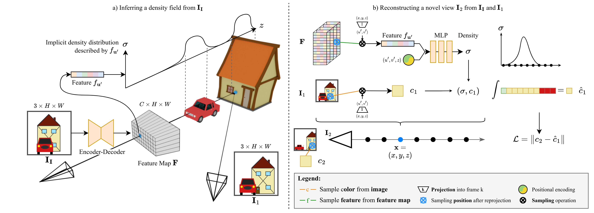

<h1>Behind the Scenes: Density Fields for Single View Reconstruction</h1>
<table style="border: none;">
<tr style="border: none;">
<td style="border: none;"><a href="https://vision.in.tum.de/members/wimbauer">Felix Wimbauer</a>1</td>
<td style="border: none;"><a href="https://nan-yang.me/">Nan Yang</a>1,3</td>
<td style="border: none;"><a href="https://chrirupp.github.io/">Christian Rupprecht</a>2</td>
<td style="border: none;"><a href="https://vision.in.tum.de/members/cremers">Daniel Cremers</a>1</td>
</tr>
</table>
<table style="border: none;">
<tr style="border: none;">
<td style="border: none;">1Technical University of Munich</td>
<td style="border: none;">2University of Oxford</td>
<td style="border: none;">3Meta</td>
</tr>
</table>
<table style="border: none;">
<tr style="border: none;">
<td style="border: none;">

<a href="#" style="color: #ffffff"><i class="bi bi-file-earmark-richtext"></i> Paper</a>

</td>
<td style="border: none;">

<a href="#" style="color: #ffffff"><i class="bi bi-github"></i> Code</a>

</td>
<td style="border: none;">

<a href="#" style="color: #ffffff"><i class="bi bi-youtube"></i> Video</a>

</td>
</tr>
</table>
 <video width="100%" autoplay muted loop>
  <source src="assets/header_vid.mp4" type="video/mp4">
Your browser does not support the video tag.
</video> 

# Abstract 

Inferring a meaningful geometric scene representation from a single image is a fundamental problem in computer vision. 
Approaches based on traditional depth map prediction can only reason about areas that are visible in the image. 
Currently, neural radiance fields (NeRFs) can capture true 3D including color but are too complex to be generated from a single image. 
As an alternative, we introduce a neural network that predicts an implicit density field from a single image. 
It maps every location in the frustum of the image to volumetric density. 
Our network can be trained through self-supervision from only video data. 
By not storing color in the implicit volume, but directly sampling color from the available views during training, our scene representation becomes significantly less complex compared to NeRFs, and we can train neural networks to predict it. 
Thus, we can apply volume rendering to perform both depth prediction and novel view synthesis. 
In our experiments, we show that our method is able to predict meaningful geometry for regions that are occluded in the input image. 
Additionally, we demonstrate the potential of our approach on three datasets for depth prediction and novel-view synthesis.

# Overview

a) Our method first predicts a pixel-aligned feature map F, which describes a density field, from the input image **I****I**.
For every pixel **u**', the feature f**u**' implicitly describes the density distribution along the ray from the camera origin through **u**'. 
Crucially, this distribution can model density even in occluded regions (e.g. the house). 

b) To render novel views, we perform volume rendering. 
For any point **x**, we project **x** into **F** and sample f**u**'. 
This feature is combined with positional encoding and fed into an MLP to obtain density σ.
We obtain the color c by projecting **x** into one of the views, in this case **I****1**, and directly sampling the image.