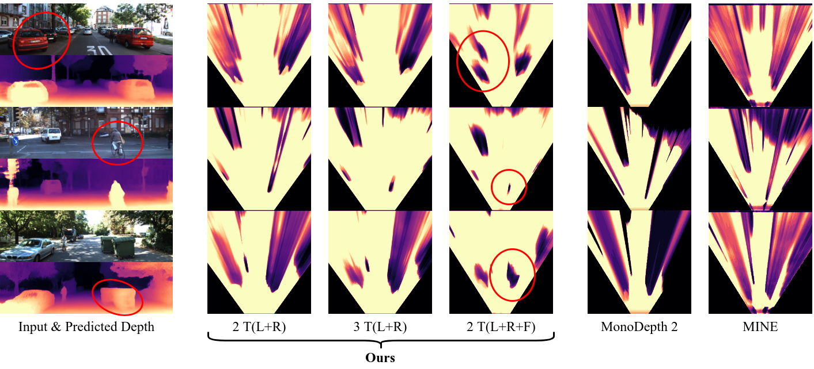

<h1>Behind the Scenes: Density Fields for Single View Reconstruction</h1>
<table style="border: none;">
<tr style="border: none;">
<td style="border: none;"><a href="https://vision.in.tum.de/members/wimbauer">Felix Wimbauer</a>1</td>
<td style="border: none;"><a href="https://nan-yang.me/">Nan Yang</a>1</td>
<td style="border: none;"><a href="https://chrirupp.github.io/">Christian Rupprecht</a>2</td>
<td style="border: none;"><a href="https://vision.in.tum.de/members/cremers">Daniel Cremers</a>1</td>
</tr>
</table>
<table style="border: none;">
<tr style="border: none;">
<td style="border: none;">1Technical University of Munich</td>
<td style="border: none;">2University of Oxford</td>
</tr>
</table>
<table style="border: none;">
<tr style="border: none;">
<td style="border: none;">
<a href="#" style="color: #ffffff">

<i class="bi bi-file-earmark-richtext"></i> Paper (Soon)

</a>
</td>
<td style="border: none;">
<a href="#" style="color: #ffffff">

<i class="bi bi-github"></i> Code (Soon)

</a>
</td>
<td style="border: none;">
<a href="#" style="color: #ffffff">

<i class="bi bi-youtube"></i> Video (Soon)

</a>
</td>
</tr>
</table>
 <video width="100%" autoplay muted loop>
  <source src="assets/header_vid.mp4" type="video/mp4">
Your browser does not support the video tag.
</video> 

# Abstract 

Inferring a meaningful geometric scene representation from a single image is a fundamental problem in computer vision. 
Approaches based on traditional depth map prediction can only reason about areas that are visible in the image. 
Currently, neural radiance fields (NeRFs) can capture true 3D including color but are too complex to be generated from a single image. 
As an alternative, we introduce a neural network that predicts an implicit density field from a single image. 
It maps every location in the frustum of the image to volumetric density. 
Our network can be trained through self-supervision from only video data. 
By not storing color in the implicit volume, but directly sampling color from the available views during training, our scene representation becomes significantly less complex compared to NeRFs, and we can train neural networks to predict it. 
Thus, we can apply volume rendering to perform both depth prediction and novel view synthesis. 
In our experiments, we show that our method is able to predict meaningful geometry for regions that are occluded in the input image. 
Additionally, we demonstrate the potential of our approach on three datasets for depth prediction and novel-view synthesis.

# Overview

**a)** Our method first predicts a pixel-aligned feature map **F**, which describes a density field, from the input image **I****I**.
For every pixel **u**', the feature f**u**' implicitly describes the density distribution along the ray from the camera origin through **u**'. 
Crucially, this distribution can model density even in occluded regions (e.g. the house). 

**b)** To render novel views, we perform volume rendering. 
For any point **x**, we project **x** into **F** and sample f**u**'. 
This feature is combined with positional encoding and fed into an MLP to obtain density σ.
We obtain the color c by projecting **x** into one of the views, in this case **I****1**, and directly sampling the image.

# Learning True 3D

Similarly to radiance fields and self-supervised depth prediction methods, we rely on an image reconstruction loss.
During training, we have the input frame **I****I** and several additional views N = {**I**1, **I**2, ..., **I**n}.
For every sample, we first predict **F** from **I****I** and randomly partition all frames N̂ = {**I****I**} ∪ N into two sets Nloss, Nrender.
We reconstruct the frames in Nloss by sampling color from Nrender using the camera poses and the predicted densities.
The photometric consistency between the reconstructed frames and the frames in Nloss serves as the supervision signal of the density field.

The key difference to self-supervised depth prediction methods, is that by design depth prediction methods can only densely reconstruct the input image.
In contrast, our density field formulation allows us to reconstruct any frame from any other frame.
Consider an area of the scene, which is occluded in the input **I****I**, but visible in two other frames **I**k , **I**1k+1, as depicted in the figure. 
During training, we aim to reconstruct this area in **I**k. 
The reconstruction based on colors sampled from **I**k+1 will give a clear training signal to correctly predict the geometric structure of this area, even though it is occluded in **I****I**. 
Note, that in order to learn geometry about occluded areas, we require at least two additional views besides the input during training, i.e. to look _behind the scenes_.

# Results

## Occupancy Estimation

**Top-down visualization of the occupancy map predicted by different methods.** 
We show an area of x = [−15m, 15m], z = [5m, 30m] and aggregate density from the y-coordinate of the camera 1m downward. 
Depth prediction methods such as MonoDepth2 do not predict a full 3D volume. 
Thus, objects cast "occupancy shadows" behind them. 
Our method predicts the full occupancy volume and can thus reason about the space behind objects. 
Training with more views improves occupancy estimation.
Inference is from a single image. 
Legend: n T(): n timesteps of, L: left camera, R: right camera, F: left and right fisheye camera.

<video width="100%" controls autoplay muted loop>
<source src="assets/occupancy_video_small.mp4" type="video/mp4">
Your browser does not support the video tag.
</video> 

**Top-down visualization and expected ray termination depth for entire sequence.** 
We use similar parameters as mentioned above. The shown sequence is ``2011_09_26_drive_0009``.

<table>
<tr>
<th style="text-align: left"><i>Method</i></th>
<th>Oacc</th>
<th>IEacc</th>
<th>IErec</th>
</tr>
<tr>
<td style="text-align: left">Depth prediction</td>
<td><b>0.93</b></td>
<td>0.00</td>
<td>0.00</td>
</tr>
<tr>
<td style="text-align: left">Ours, 3x T (L)</td>
<td><u>0.92</u></td>
<td><b>0.95</b></td>
<td>0.10</td>
</tr>
<tr>
<td style="text-align: left">Ours, 3x T (L + R)</td>
<td><b>0.93</b></td>
<td>0.76</td>
<td><u>0.12</u></td>
</tr>
<tr>
<td style="text-align: left">Ours, 2x T (L + R + F)</td>
<td><b>0.93</b></td>
<td><u>0.79</u></td>
<td><b>0.38</b></td>
</tr>
</table>

**3D Scene Occupancy Accuracy.** 
We evaluate the capability of the model to predict occupancy behind objects in the image. 
Depth prediction naturally has no ability to predict behind occlusions, while our method improves when training with more views. 
Inference from a single image. Samples are evenly spaced in a cuboid w = [−4m, 4m], h = [−1m, 0m], d = [3m, 20m] relative to the camera. 
We use the same models as in the previous figure.

## Depth Prediction

<table class="tg">
<thead>
  <tr>
    <th class="tg-obg7">Model</th>
    <th class="tg-pb0m">Split</th>
    <th class="tg-pb0m">Abs Rel</th>
    <th class="tg-pb0m">Sq Rel</th>
    <th class="tg-pb0m">RMSE</th>
    <th class="tg-pb0m">RMSE Log</th>
    <th class="tg-pb0m">A1</th>
    <th class="tg-8d8j">A2</th>
    <th class="tg-8d8j">A3</th>
  </tr>
</thead>
<tbody>
  <tr>
    <td class="tg-obg7">EPC++</td>
    <td class="tg-pb0m">Eigen</td>
    <td class="tg-pb0m">0.128</td>
    <td class="tg-pb0m">1.132</td>
    <td class="tg-pb0m">5.585</td>
    <td class="tg-pb0m">0.209</td>
    <td class="tg-pb0m">0.831</td>
    <td class="tg-8d8j">0.945</td>
    <td class="tg-8d8j">0.979</td>
  </tr>
  <tr>
    <td class="tg-za14">Monodepth2</td>
    <td class="tg-pb0m"></td>
    <td class="tg-pb0m">0.106</td>
    <td class="tg-pb0m">0.818</td>
    <td class="tg-pb0m">4.750</td>
    <td class="tg-pb0m">0.196</td>
    <td class="tg-pb0m">0.874</td>
    <td class="tg-8d8j">0.957</td>
    <td class="tg-8d8j">0.975</td>
  </tr>
  <tr>
    <td class="tg-za14">PackNet (no stereo)</td>
    <td class="tg-pb0m"></td>
    <td class="tg-pb0m">0.111</td>
    <td class="tg-pb0m">0.785</td>
    <td class="tg-apkk">4.601</td>
    <td class="tg-apkk">0.189</td>
    <td class="tg-pb0m">0.878</td>
    <td class="tg-8d8j">0.960</td>
    <td class="tg-8d8j">0.982</td>
  </tr>
  <tr>
    <td class="tg-za14">DepthHint</td>
    <td class="tg-pb0m"></td>
    <td class="tg-pb0m">0.105</td>
    <td class="tg-pb0m">0.769</td>
    <td class="tg-pb0m">4.627</td>
    <td class="tg-pb0m">0.189</td>
    <td class="tg-pb0m">0.875</td>
    <td class="tg-8d8j">0.959</td>
    <td class="tg-8d8j">0.982</td>
  </tr>
  <tr>
    <td class="tg-za14">FeatDepth</td>
    <td class="tg-fll5"></td>
    <td class="tg-fll5">0.099</td>
    <td class="tg-fll5">0.697</td>
    <td class="tg-fll5">4.427</td>
    <td class="tg-fll5">0.184</td>
    <td class="tg-fll5">0.889</td>
    <td class="tg-8d8j">0.963</td>
    <td class="tg-8d8j">0.982</td>
  </tr>
  <tr>
    <td class="tg-za14">DevNet</td>
    <td class="tg-apkk"></td>
    <td class="tg-apkk">0.095</td>
    <td class="tg-apkk">0.671</td>
    <td class="tg-pb0m">4.365</td>
    <td class="tg-pb0m">0.174</td>
    <td class="tg-apkk">0.895</td>
    <td class="tg-8d8j">0.970</td>
    <td class="tg-8d8j">0.988</td>
  </tr>
  <tr>
    <td class="tg-0thz">Ours</td>
    <td class="tg-8d8j"></td>
    <td class="tg-8d8j">0.102</td>
    <td class="tg-8d8j">0.751</td>
    <td class="tg-8d8j">4.407</td>
    <td class="tg-8d8j">0.188</td>
    <td class="tg-8d8j">0.882</td>
    <td class="tg-8d8j">0.961</td>
    <td class="tg-8d8j">0.982</td>
  </tr>
  <tr style="height: 5px;"></tr>
  <tr>
    <td class="tg-za14">MINE</td>
    <td class="tg-8d8j">Tulsiani</td>
    <td class="tg-8d8j">0.137</td>
    <td class="tg-8d8j">1.993</td>
    <td class="tg-8d8j">6.592</td>
    <td class="tg-8d8j">0.250</td>
    <td class="tg-8d8j">0.839</td>
    <td class="tg-8d8j">0.940</td>
    <td class="tg-8d8j">0.971</td>
  </tr>
  <tr>
    <td class="tg-0thz">Ours</td>
    <td class="tg-8d8j"></td>
    <td class="tg-8d8j">0.132</td>
    <td class="tg-8d8j">1.936</td>
    <td class="tg-8d8j">6.104</td>
    <td class="tg-8d8j">0.235</td>
    <td class="tg-8d8j">0.873</td>
    <td class="tg-8d8j">0.951</td>
    <td class="tg-8d8j">0.974</td>
  </tr>
</tbody>
</table>

**Depth Prediction.**
While our goal is fully volumetric scene understanding, we compare to the state of the art in depth estimation trained only with reconstruction losses. 
Our approach achieves competitive performance with specialized methods while improving over the only other fully volumetric approach MINE. 
DevNet performs better, but does not show any results from the volume directly.

## Novel View Synthesis

<table style="border: none;">
<tr style="border: none;">
<td style="border: none; padding: 0px;">
<video width="100%" autoplay muted loop><source src="assets/nvs_kitti/000039.mp4" type="video/mp4">Your browser does not support the video tag.</video>
</td>
<td style="border: none; padding: 0px;">
<video width="100%" autoplay muted loop><source src="assets/nvs_kitti/000051.mp4" type="video/mp4">Your browser does not support the video tag.</video>
</td>
<td style="border: none; padding: 0px;">
<video width="100%" autoplay muted loop><source src="assets/nvs_kitti/000102.mp4" type="video/mp4">Your browser does not support the video tag.</video>
</td>
</tr>
<tr style="border: none;">
<td style="border: none; padding: 0px;">
<video width="100%" autoplay muted loop><source src="assets/nvs_kitti/000196.mp4" type="video/mp4">Your browser does not support the video tag.</video>
</td>
<td style="border: none; padding: 0px;">
<video width="100%" autoplay muted loop><source src="assets/nvs_kitti/000214.mp4" type="video/mp4">Your browser does not support the video tag.</video>
</td>
<td style="border: none; padding: 0px;">
<video width="100%" autoplay muted loop><source src="assets/nvs_kitti/000397.mp4" type="video/mp4">Your browser does not support the video tag.</video>
</td>
</tr>
</table>

**Novel-view synthesis on KITTI.**
We only use a single input frame, from which we both predict density and sample color.
This means, that areas that are occluded in the input image do not have valid color samples.

<table style="border: none;">
<tr style="border: none;">
<td style="border: none; padding: 0px;">
<video width="100%" autoplay muted loop><source src="assets/nvs_re10k/00.mp4" type="video/mp4">Your browser does not support the video tag.</video>
</td>
<td style="border: none; padding: 0px;">
<video width="100%" autoplay muted loop><source src="assets/nvs_re10k/01.mp4" type="video/mp4">Your browser does not support the video tag.</video>
</td>
<td style="border: none; padding: 0px;">
<video width="100%" autoplay muted loop><source src="assets/nvs_re10k/02.mp4" type="video/mp4">Your browser does not support the video tag.</video>
</td>
</tr>
<tr style="border: none;">
<td style="border: none; padding: 0px;">
<video width="100%" autoplay muted loop><source src="assets/nvs_re10k/03.mp4" type="video/mp4">Your browser does not support the video tag.</video>
</td>
<td style="border: none; padding: 0px;">
<video width="100%" autoplay muted loop><source src="assets/nvs_re10k/04.mp4" type="video/mp4">Your browser does not support the video tag.</video>
</td>
<td style="border: none; padding: 0px;">
<video width="100%" autoplay muted loop><source src="assets/nvs_re10k/05.mp4" type="video/mp4">Your browser does not support the video tag.</video>
</td>
</tr>
</table>

**Novel-view synthesis on RealEstate10K.**
We only use a single input frame, from which we both predict density and sample color.
This means, that areas that are occluded in the input image do not have valid color samples.